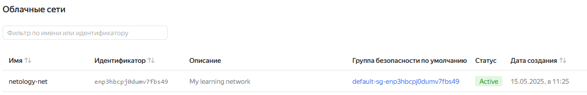
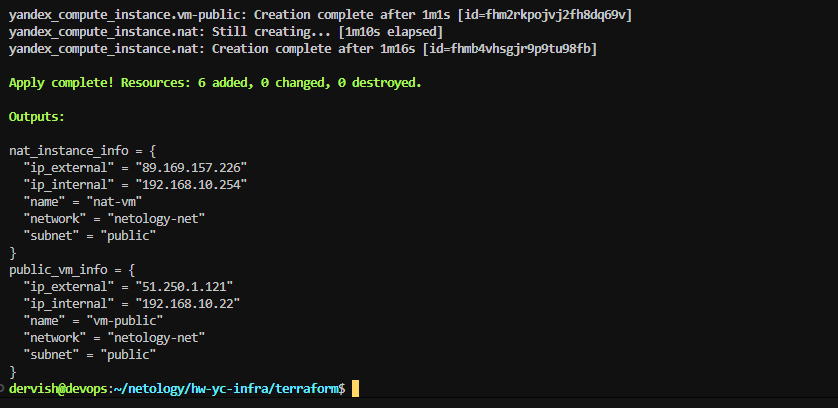
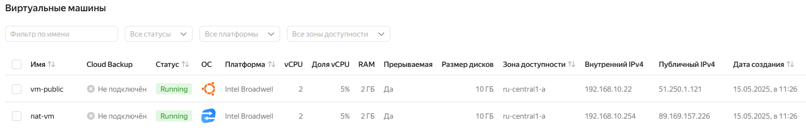
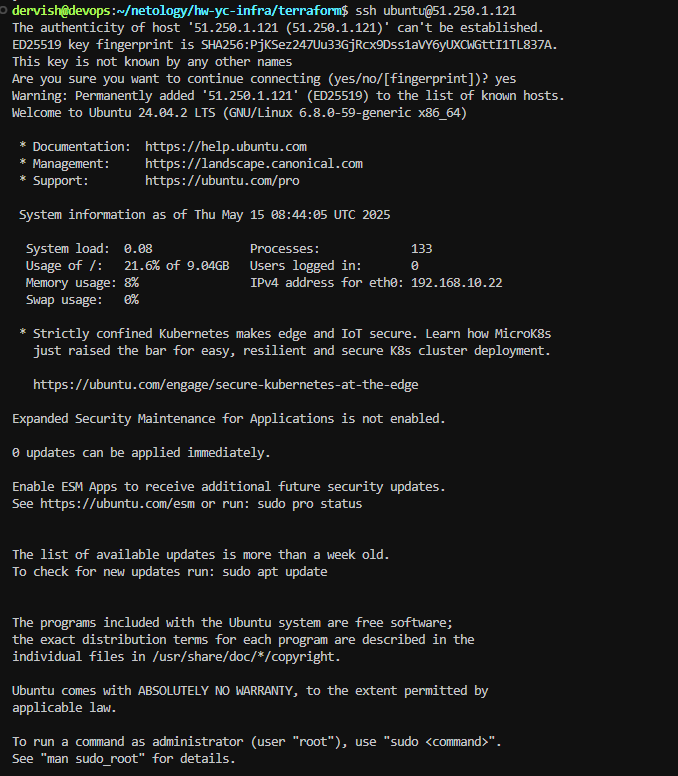
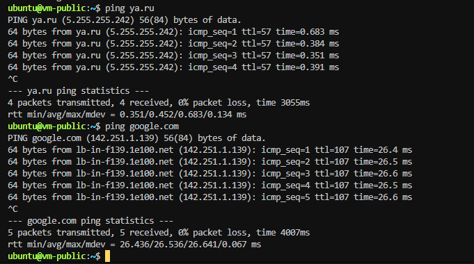
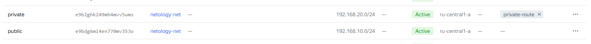

# Домашнее задание к занятию «Организация сети»

## Задание 1. Yandex Cloud

**Что нужно сделать**

1. Создать пустую VPC. Выбрать зону.

```
resource "yandex_vpc_network" "vpc-netology" {
  name = var.vpc_name
  description = "My learning network"
}
```

2. Публичная подсеть.

    Создать в VPC subnet с названием public, сетью 192.168.10.0/24.

    ```
    resource "yandex_vpc_subnet" "public" {
    name           = var.public_subnet
    zone           = var.default_zone
    network_id     = yandex_vpc_network.vpc-netology.id
    v4_cidr_blocks = var.public_cidr
    }
    ```

    > [vpc.tf](./terraform/vpc.tf)  [variables.tf](./terraform/variables.tf)

    

    Создать в этой подсети NAT-инстанс, присвоив ему адрес 192.168.10.254. В качестве image_id использовать fd80mrhj8fl2oe87o4e1.

    > [vm-nat.tf](./terraform/vm-nat.tf)

    Создать в этой публичной подсети виртуалку с публичным IP, подключиться к ней и убедиться, что есть доступ к интернету.

    > [vm-public.tf](./terraform/vm-public.tf)

    
    
    
    

3. Приватная подсеть.

    Создать в VPC subnet с названием private, сетью 192.168.20.0/24.
    Создать route table. Добавить статический маршрут, направляющий весь исходящий трафик private сети в NAT-инстанс.

    

    Создать в этой приватной подсети виртуалку с внутренним IP, подключиться к ней через виртуалку, созданную ранее, и убедиться, что есть доступ к интернету.

