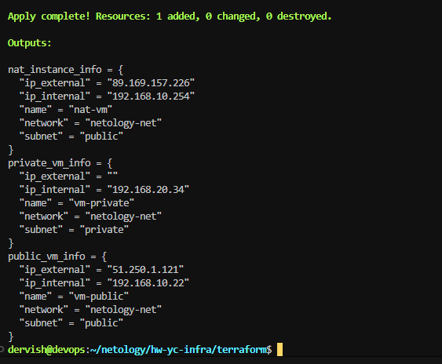
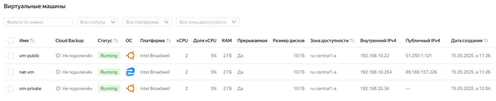
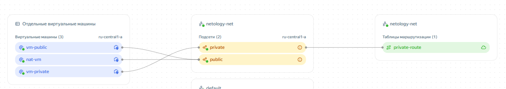
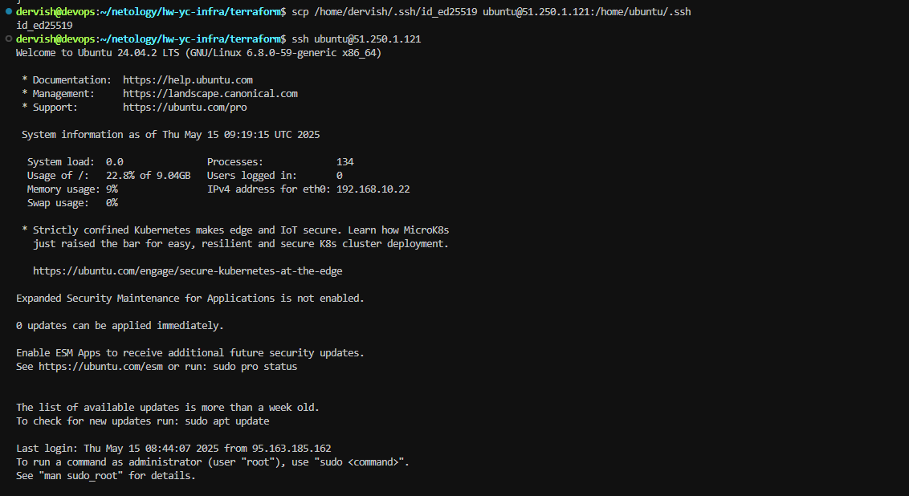
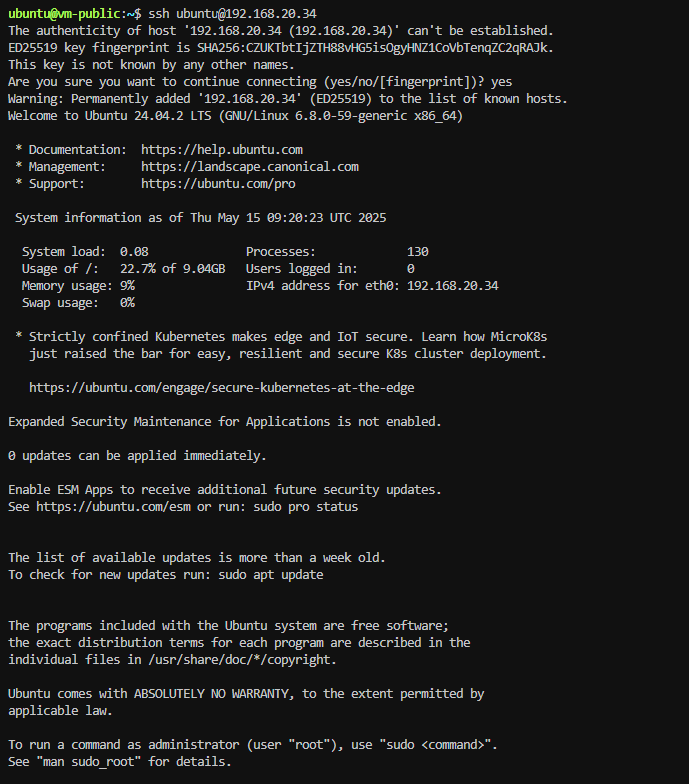
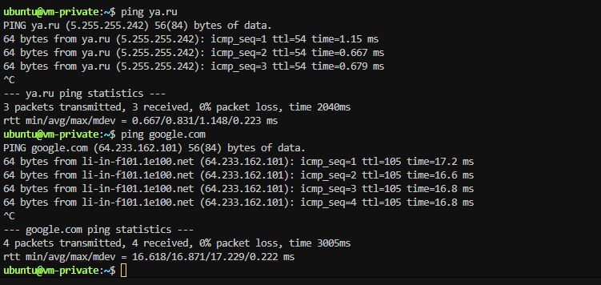
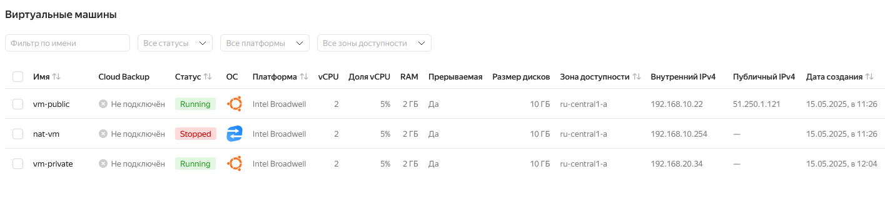
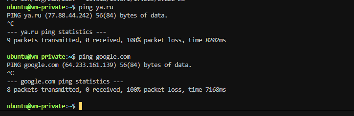
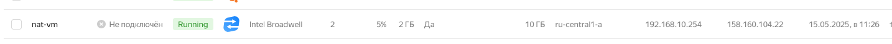

# Домашнее задание к занятию «Организация сети»

## Задание 1. Yandex Cloud

**Что нужно сделать**

1. Создать пустую VPC. Выбрать зону.

```
resource "yandex_vpc_network" "vpc-netology" {
  name = var.vpc_name
  description = "My learning network"
}
```

2. Публичная подсеть.

    Создать в VPC subnet с названием public, сетью 192.168.10.0/24.

    ```
    resource "yandex_vpc_subnet" "public" {
    name           = var.public_subnet
    zone           = var.default_zone
    network_id     = yandex_vpc_network.vpc-netology.id
    v4_cidr_blocks = var.public_cidr
    }
    ```

    > [vpc.tf](./terraform/vpc.tf)  [variables.tf](./terraform/variables.tf)

    

    Создать в этой подсети NAT-инстанс, присвоив ему адрес 192.168.10.254. В качестве image_id использовать fd80mrhj8fl2oe87o4e1.

    > [vm-nat.tf](./terraform/vm-nat.tf)

    Создать в этой публичной подсети виртуалку с публичным IP, подключиться к ней и убедиться, что есть доступ к интернету.

    > [vm-public.tf](./terraform/vm-public.tf)

    
    
    
    

3. Приватная подсеть.

    Создать в VPC subnet с названием private, сетью 192.168.20.0/24.

    ```
    resource "yandex_vpc_subnet" "private" {
      name           = var.private_subnet
      zone           = var.default_zone
      network_id     = yandex_vpc_network.vpc-netology.id
      v4_cidr_blocks = var.private_cidr
      route_table_id = yandex_vpc_route_table.private-route.id
    }
    
    ```

    Создать route table. Добавить статический маршрут, направляющий весь исходящий трафик private сети в NAT-инстанс.

    ```
    resource "yandex_vpc_route_table" "private-route" {
      name       = "private-route"
      network_id = yandex_vpc_network.vpc-netology.id
      static_route {
        destination_prefix = "0.0.0.0/0"
        next_hop_address   = "192.168.10.254"
      }
    }

    ```

    

    Создать в этой приватной подсети виртуалку с внутренним IP, подключиться к ней через виртуалку, созданную ранее, и убедиться, что есть доступ к интернету.

    > [vm-private.tf](./terraform/vm-private.tf)

    
    
    

    >Для проверки доступности интернета на приватной ВМ через NAT-инстанс копируем свой приватный ssh ключ на публичную ВМ. Затем с публичной ВМ подключаемся к приватной по внутреннему IP адресу

  
  
  

  >Доступ в интернет есть. Теперь попробуем временно отключить NAT-инстанс и проверить доступность интернета на приватной ВМ.

  

  >Как видим, доступ пропал. Для возобновления доступа необходимо обратно включить NAT-инстанс

  
  
  
